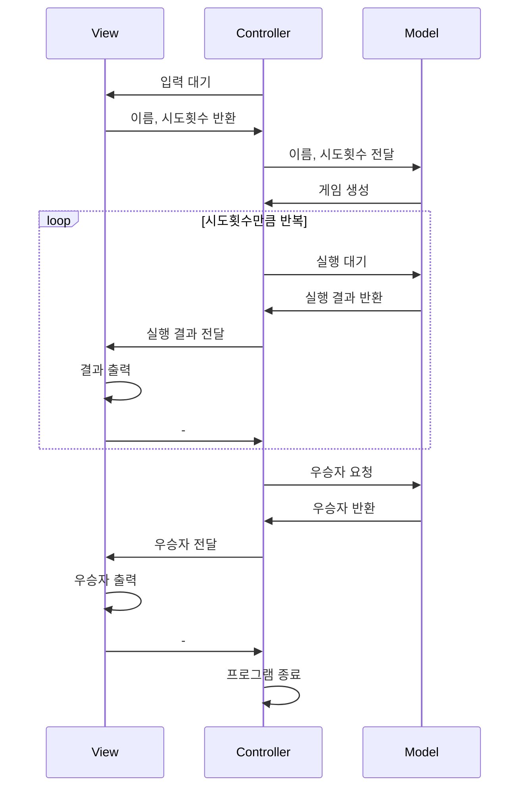

# java-racingCar-precourse


> 콩 번째로 하는 우테코의 콩 번째 미션 \
> 콩 번째로 하는 우테코의 콩 번째 미션

<details>
	<summary>과제 세부 내용</summary>

## 과제 내용
초간단 자동차 경주 게임을 구현한다.

- 주어진 횟수 동안 n대의 자동차는 전진 또는 멈출 수 있다.
- 각 자동차에 이름을 부여할 수 있다. 전진하는 자동차를 출력할 때 자동차 이름을 같이 출력한다.
- 자동차 이름은 쉼표(,)를 기준으로 구분하며 이름은 5자 이하만 가능하다.
- 사용자는 몇 번의 이동을 할 것인지를 입력할 수 있어야 한다.
- 전진하는 조건은 0에서 9 사이에서 무작위 값을 구한 후 무작위 값이 4 이상일 경우이다.
- 자동차 경주 게임을 완료한 후 누가 우승했는지를 알려준다. 우승자는 한 명 이상일 수 있다.
- 우승자가 여러 명일 경우 쉼표(,)를 이용하여 구분한다.
- 사용자가 잘못된 값을 입력할 경우 `IllegalArgumentException`을 발생시킨 후 애플리케이션은 종료되어야 한다.

### 입출력
- 입력
    - 경주 할 자동차 이름
    - 시도할 횟수
- 출력
    - 각 차수별 실행 결과
    - 우승자 안내 문구

ex)

```
경주할 자동차 이름을 입력하세요.(이름은 쉼표(,) 기준으로 구분)
pobi,woni,jun
시도할 회수는 몇회인가요?
5

실행 결과
pobi : -
woni :
jun : -

pobi : --
woni : -
jun : --

pobi : ---
woni : --
jun : ---

pobi : ----
woni : ---
jun : ----

pobi : -----
woni : ----
jun : -----

최종 우승자 : pobi, jun
```

</details>

## 코드 흐름
- 사용자의 이름 및 시도 횟수를 입력받는다. 이름의 유효성을 검증한다. 
- 랜덤으로 자동차의 전진 횟수를 더한다. 
- 최종 우승자를 출력한다. 



## 구현 기능 목록
- 입출력
  - [ ] 사용자 이름 입력
  - [ ] 시도 횟수 입력
  - [ ] 차수별 실행 결과 출력
  - [ ] 최종 우승자 출력
- 자동차 전진
  - [ ] 여러 자동차의 상태 관리
  - [ ] 랜덤 추출 기능